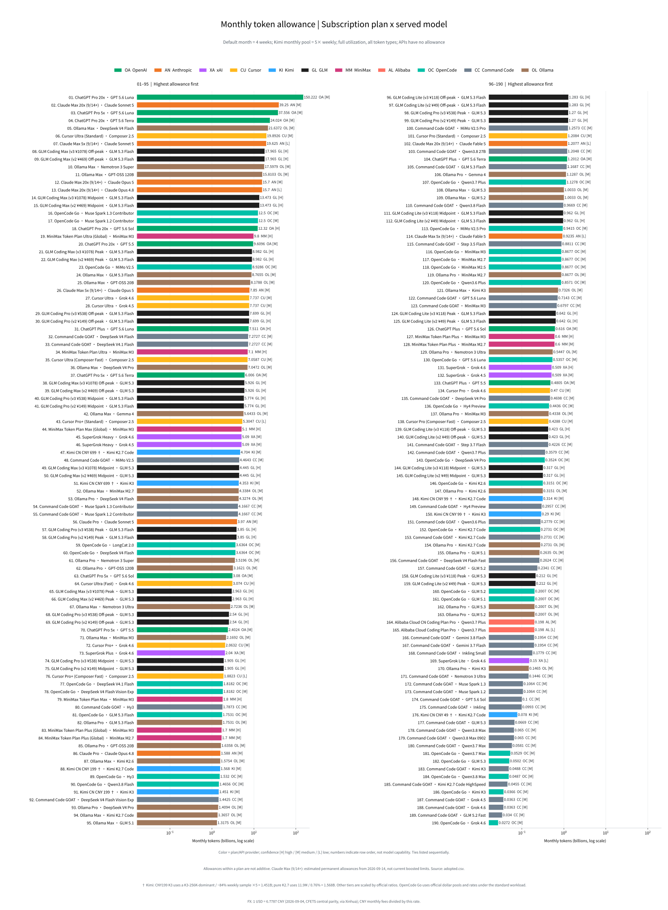
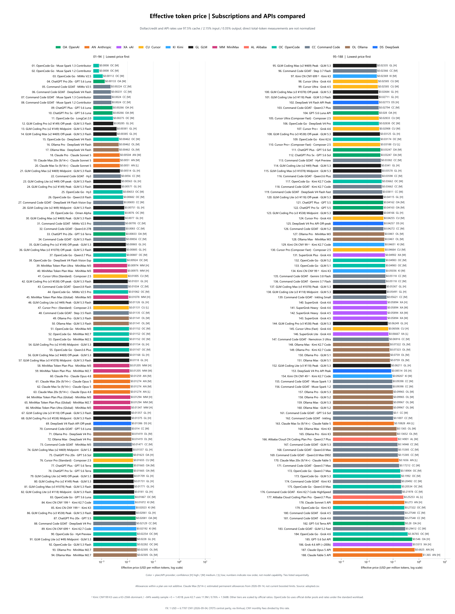
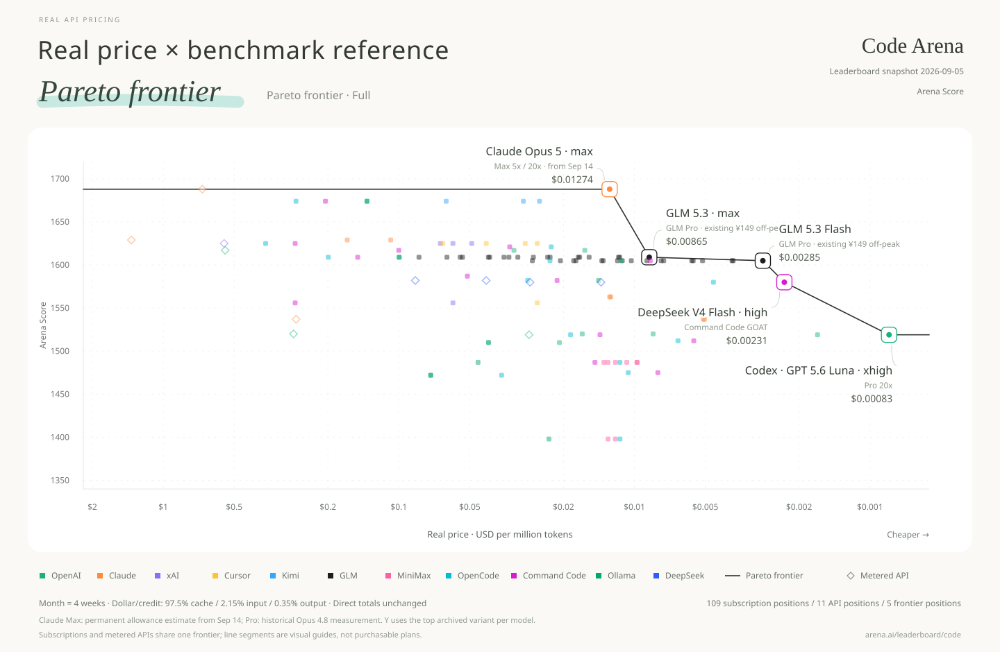
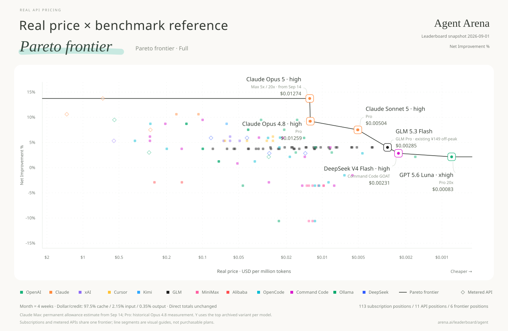
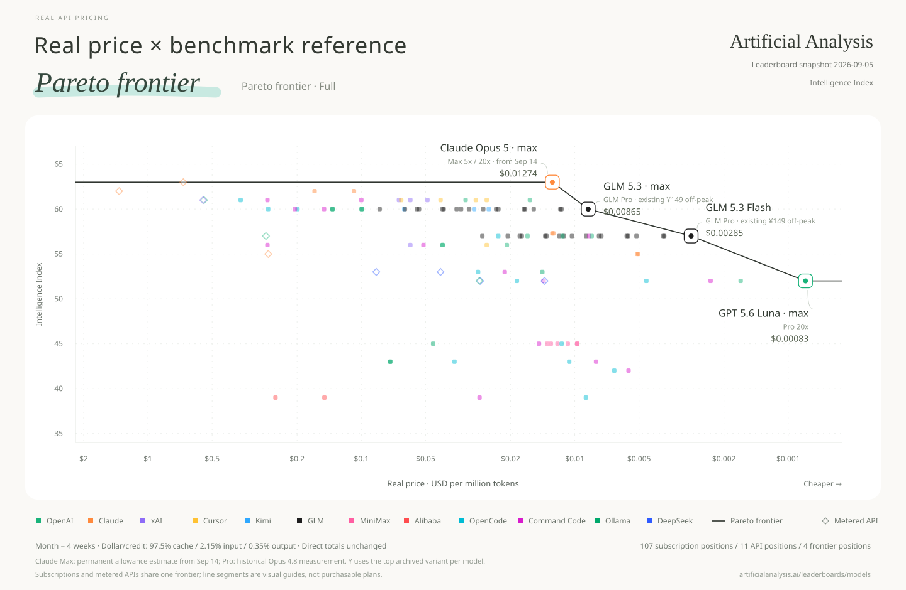
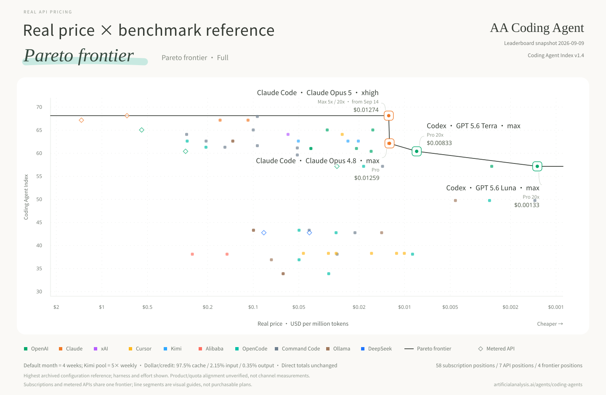

**English** | [中文](README.zh.md)

# Real API Pricing

**Real unit price = monthly subscription fee ÷ monthly usable tokens.**

Full adopted data is shown first, followed by one Pareto chart per leaderboard. Month = four weeks of saturated use; input, output and cache tokens are all included. Prices use a logarithmic axis, with cheaper points farther right.

Dollar/credit pools and three-part token prices are converted with one project-wide standard workload: **97.5% cache reads, 2.15% fresh input, and 0.35% output**. This is a comparison convention, not a claim about any provider's actual workload. Measurements that already report total tokens—dashboard back-calculations, local usage logs, controlled saturation tests, and official absolute-token tables—are not normalized again. Where only total tokens and a cost-weighted percentage are available but the token-type split is unknown, the observed total is retained and the limitation is recorded rather than inventing a split. See [conventions](data/conventions.json) and the [token-mix audit](data/research/token-mix-audit-round2-2026-09-07.json).

GLM Coding Plan is now recomputed from Zhipu's official weekly credits and cache/input/output credit coefficients using the same standard workload, rather than copying the official 95%-cache example table. Peak and off-peak capacities are still averaged and multiplied by four weeks. A Caijing saturation-cost test and community evidence are consistent in scale, but there is still no fully specified independent V3 Pro/Max saturation test. See the [official-table archive](data/research/quotas-web-2026-09.json) and [community-evidence review](data/research/glm-community-round1-2026-09-07.json).

**[All charts: English / 中文, SVG / PNG](charts/README.md)** · [English files](charts/en/) · [中文文件](charts/zh/)

**[Interactive website (TanStack)](website/)** — Vite static build with EN/中文 toggle; see [website/README.md](website/README.md) for deploy.

## Data snapshot

Snapshot: 2026-09-07. Each row is one **plan × actual served model**; allowances of different models under the same plan are alternatives and must not be added together.

| Coverage | Rows |
|---|---:|
| All adopted plan × model points | 155 |
| Subscription points with monthly allowance | 149 |
| Metered API baselines | 6 |
| OpenCode Go / Command Code GOAT / Ollama models | 28 / 38 / 20 |
| Code Arena / Agent Arena scored points | 105 / 109 |
| AA Intelligence / AA Coding Agent scored points | 102 / 55 |

**Download the data:** [adopted values (CSV)](data/adopted.csv) · [computed points (CSV)](derived/points.csv) · [computed points (JSON)](derived/points.json) · [data notes and score coverage](data/README.md) · [dated evidence](data/research/)

## Monthly allowance overview

All 149 subscription plan × model points, sorted by monthly usable tokens. The standard chart keeps a single logarithmic scale; the hybrid-scale view makes the two very large ChatGPT allowances easier to compare.

[English SVG](charts/en/overview/monthly-allowance-overview.svg) · [中文 SVG](charts/zh/overview/额度总览.svg) · [English PNG](charts/en/overview/monthly-allowance-overview.png) · [中文 PNG](charts/zh/overview/额度总览.png) · [Hybrid-scale view](charts/en/overview/monthly-allowance-overview-hybrid-scale.svg)

**Full table:** [English TXT](charts/en/overview/monthly-allowance-overview-table.txt) · [中文 TXT](charts/zh/overview/额度总览表.txt)

## Real unit price overview

All 155 subscription and API points on one comparable $/MTok scale.

[English SVG](charts/en/overview/real-price-overview.svg) · [中文 SVG](charts/zh/overview/单价总览.svg) · [English PNG](charts/en/overview/real-price-overview.png) · [中文 PNG](charts/zh/overview/单价总览.png)

**Full table:** [English TXT](charts/en/overview/real-price-overview-table.txt) · [中文 TXT](charts/zh/overview/单价总览表.txt)

## Pareto charts by leaderboard

Using Real API Pricing as a new baseline, we plot each leaderboard's scores on the Y-axis to redraw its Pareto frontier; the connected line represents that frontier.

### Code Arena

[English SVG](charts/en/pareto/pareto-code-arena.svg) · [中文 SVG](charts/zh/pareto/帕累托_CodeArena榜.svg) · [English PNG](charts/en/pareto/pareto-code-arena.png) · [中文 PNG](charts/zh/pareto/帕累托_CodeArena榜.png)

### Agent Arena

[English SVG](charts/en/pareto/pareto-agent-arena.svg) · [中文 SVG](charts/zh/pareto/帕累托_AgentArena榜.svg) · [English PNG](charts/en/pareto/pareto-agent-arena.png) · [中文 PNG](charts/zh/pareto/帕累托_AgentArena榜.png)

### AA Intelligence

[English SVG](charts/en/pareto/pareto-aa-intelligence.svg) · [中文 SVG](charts/zh/pareto/帕累托_AA智力榜.svg) · [English PNG](charts/en/pareto/pareto-aa-intelligence.png) · [中文 PNG](charts/zh/pareto/帕累托_AA智力榜.png)

### AA Coding Agent

[English SVG](charts/en/pareto/pareto-aa-coding-agent.svg) · [中文 SVG](charts/zh/pareto/帕累托_AA编程Agent榜.svg) · [English PNG](charts/en/pareto/pareto-aa-coding-agent.png) · [中文 PNG](charts/zh/pareto/帕累托_AA编程Agent榜.png)

AA Coding Agent scores describe tested harness × model configurations, with the highest archived configuration used per exact model.

## Method and reproduction

[Build instructions](BUILD.md) · [Data documentation](data/README.md) · [Sources and attribution](SOURCES.md)

## License and acknowledgements

Original software: [MIT](LICENSE). Data references include [Awesome Coding Plan](https://github.com/mahonzhan/awesome-coding-plan) (CC BY 4.0) and the Caijing article 《Token经济，中国账本》. See [SOURCES.md](SOURCES.md) for attribution, changes and third-party terms.
