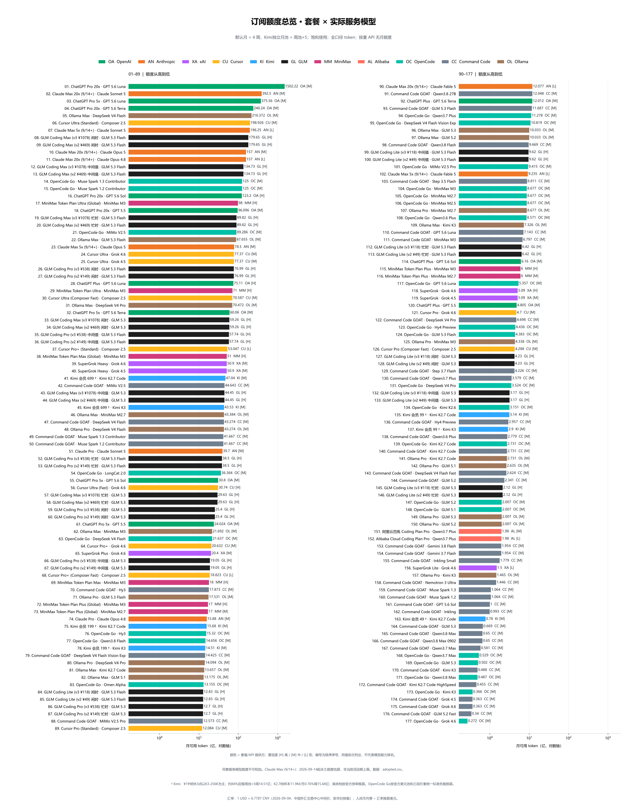
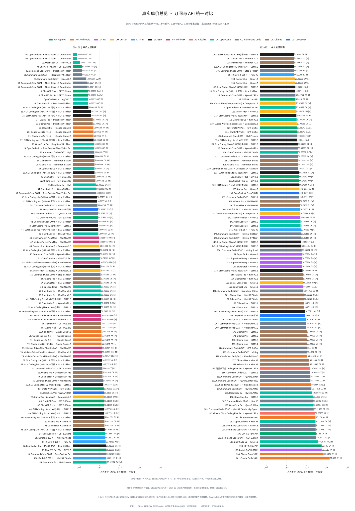
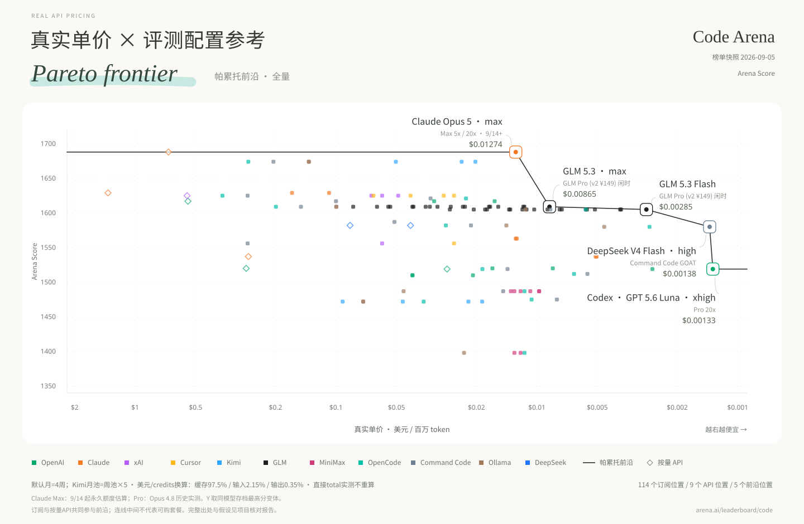
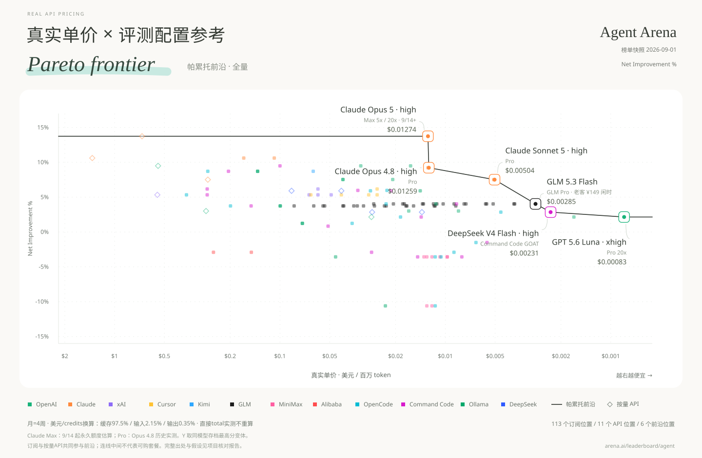
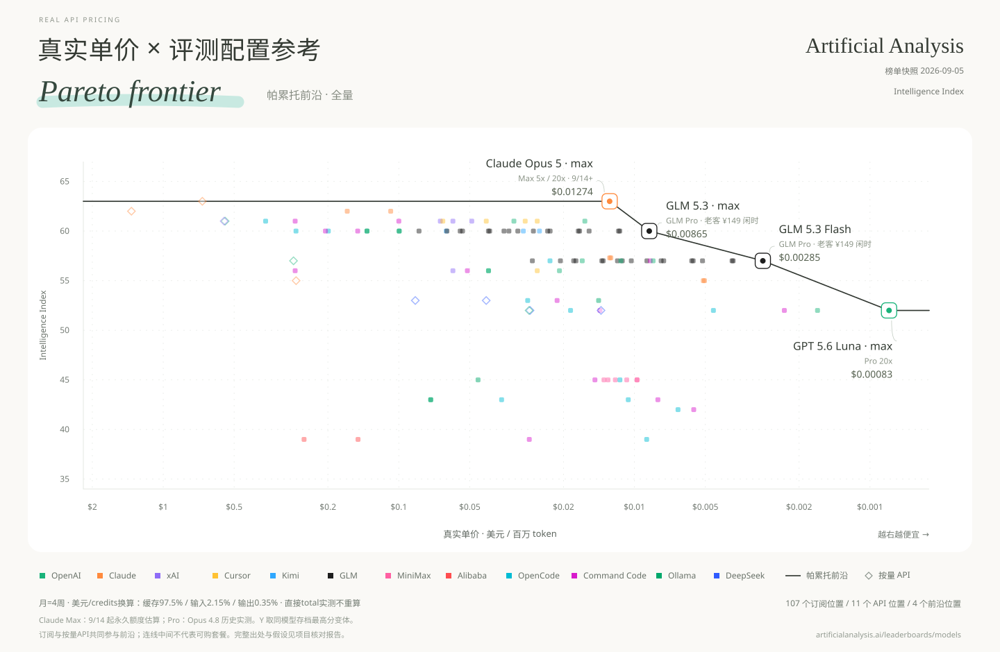
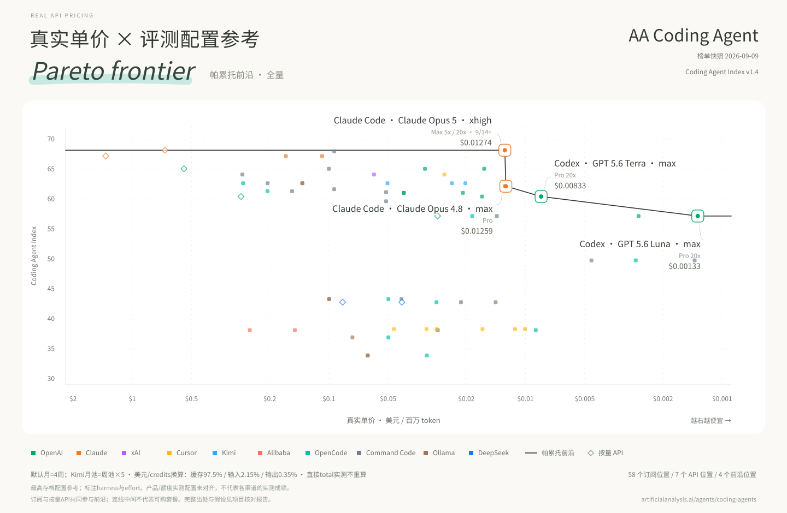

[English](README.md) | **中文**

# 真实 API 定价

**真实单价 = 订阅月费 ÷ 每月实际可用 token。**

先展示完整采用数据，再按榜单展示帕累托图。按饱和使用、每月四周计算，输入、输出与缓存 token 全部计入；单价使用对数轴，越右越便宜。

凡是由美元/credits 额度和缓存、输入、输出三段价格换算 token，统一使用项目标准负载：**缓存读取 97.5%、普通输入 2.15%、输出 0.35%**。这是统一比较口径，不代表任何厂商或用户的实际负载。已经直接给出 total tokens 的面板反推、本地日志、受控跑满和官方绝对 token 表不再重复归一；只有 total tokens 和按费用扣减的百分比、但缺 token 类型拆分时，保留实际观测并明确限制，不编造组成。当前标准不单列 cache write；厂商另收缓存写入费时，换算结果可能偏高估 token。详见[统一口径](data/conventions.json)与[token 组成审计](data/research/token-mix-audit-round2-2026-09-07.json)。

GLM Coding Plan 现已改用智谱官方周积分和缓存/输入/输出三段积分系数，并按同一标准负载重算；忙时、中间值和闲时三个情景分开展示，不再直接抄官方95%缓存示例表。《财经》跑满成本和社区证据在量级上吻合，但目前仍没有信息完整的 V3 Pro/Max 独立跑满样本。详见[官方表存档](data/research/quotas-web-2026-09.json)与[社区证据复核](data/research/glm-community-round1-2026-09-07.json)。

四张图的 Y 轴分别取自对应榜单，分数互不混用。这里的 Code Arena 特指 WebDev Overall 的 Arena Score，不代表通用编程能力。图中最右侧的 GPT-5.6 Luna 2402.4亿来自 Sol 基准和官方 credits 比例的多层派生，置信度为 medium，并非打满实测；Claude Max 157亿则是2026年9月14日起永久口径的估算，不是活动期上限。中文图以“亿”为单位，英文图以 billion 为单位，77.37亿对应7.737 billion。

**[全部图表：中英文、SVG / PNG](charts/README.md)** · [English files](charts/en/) · [中文文件](charts/zh/)

**[交互网站（TanStack）](website/)** — Vite 静态构建，支持中英文切换；部署见 [website/README.md](website/README.md)。

## 数据快照

快照日期：2026-09-07。每行代表一个**套餐 × 实际服务模型**；同一套餐下不同模型的额度是替代关系，不能相加。

| 覆盖范围 | 行数 |
|---|---:|
| 全部采用的套餐 × 模型点 | 184 |
| 有月额度的订阅点 | 173 |
| 按量 API 基准点 | 11 |
| OpenCode Go / Command Code GOAT / Ollama 模型 | 28 / 38 / 20 |
| Code Arena / Agent Arena 有分点 | 134 / 138 |
| AA 智力榜 / AA 编程 Agent 榜有分点 | 131 / 59 |

**下载数据：** [采用值 CSV](data/adopted.csv) · [完整计算结果 CSV](derived/points.csv) · [完整计算结果 JSON](derived/points.json) · [数据说明及缺分清单](data/README.md) · [分日期原始证据](data/research/)

## 月额度总览

展示全部 173 个订阅套餐 × 模型点，按每月可用 token 排序。标准图统一使用对数轴；混合比例图用于看清两个特别大的 ChatGPT 额度。

[English SVG](charts/en/overview/monthly-allowance-overview.svg) · [中文 SVG](charts/zh/overview/额度总览.svg) · [English PNG](charts/en/overview/monthly-allowance-overview.png) · [中文 PNG](charts/zh/overview/额度总览.png) · [混合比例图](charts/zh/overview/额度总览_混合比例.svg)

**完整数据表：** [中文 TXT](charts/zh/overview/额度总览表.txt) · [English TXT](charts/en/overview/monthly-allowance-overview-table.txt)

## 真实单价总览

把全部 184 个订阅和 API 点放在同一套 $/MTok 口径下比较。

[English SVG](charts/en/overview/real-price-overview.svg) · [中文 SVG](charts/zh/overview/单价总览.svg) · [English PNG](charts/en/overview/real-price-overview.png) · [中文 PNG](charts/zh/overview/单价总览.png)

**完整数据表：** [中文 TXT](charts/zh/overview/单价总览表.txt) · [English TXT](charts/en/overview/real-price-overview-table.txt)

## 分榜帕累托图

依据“真实 API 定价”这一新基准，结合不同榜单的分数作为 Y 轴，重新绘制帕累托前沿图；图中的连线即代表帕累托前沿。订阅与按量 API 使用同一支配规则，共同参与前沿筛选。

### Code Arena

[English SVG](charts/en/pareto/pareto-code-arena.svg) · [中文 SVG](charts/zh/pareto/帕累托_CodeArena榜.svg) · [English PNG](charts/en/pareto/pareto-code-arena.png) · [中文 PNG](charts/zh/pareto/帕累托_CodeArena榜.png)

### Agent Arena

[English SVG](charts/en/pareto/pareto-agent-arena.svg) · [中文 SVG](charts/zh/pareto/帕累托_AgentArena榜.svg) · [English PNG](charts/en/pareto/pareto-agent-arena.png) · [中文 PNG](charts/zh/pareto/帕累托_AgentArena榜.png)

### AA Intelligence

[English SVG](charts/en/pareto/pareto-aa-intelligence.svg) · [中文 SVG](charts/zh/pareto/帕累托_AA智力榜.svg) · [English PNG](charts/en/pareto/pareto-aa-intelligence.png) · [中文 PNG](charts/zh/pareto/帕累托_AA智力榜.png)

### AA Coding Agent

[English SVG](charts/en/pareto/pareto-aa-coding-agent.svg) · [中文 SVG](charts/zh/pareto/帕累托_AA编程Agent榜.svg) · [English PNG](charts/en/pareto/pareto-aa-coding-agent.png) · [中文 PNG](charts/zh/pareto/帕累托_AA编程Agent榜.png)

AA 编程 Agent 分数属于已测试的 harness × 模型 × effort 配置。静态图和 `points.*` 明确为**最高存档配置参考汇总**，不代表各订阅/API渠道实测；额度样本的effort、产品harness是否对齐仍未验证。更高effort不自动提高每百万token单价，但可能增加每任务token消耗。

[全配置交互图](charts/zh/pareto/帕累托交互图.html) 默认展示全部存档配置，可切换最高分汇总。下载HTML后本地打开，Plotly需要联网。目前全部采用参考映射，尚不是已验证产品配置的严格前沿。

[评测配置JSON](derived/benchmark-configurations.json) / [CSV](derived/benchmark-configurations.csv) 完整保留128条记录、原始标签、已知harness/effort、30条来源分数区间和70条来源任务成本。[套餐配置映射JSON](derived/benchmark-points.json) / [CSV](derived/benchmark-points.csv) 包含604条明确参考映射，保留低effort配置。Composer Standard/Fast只匹配本模式，缺失时留空；未知harness、effort、区间均不推测。

来源任务成本的均值和中位数分别保留，不作为订阅内任务成本。分数区间可在交互图悬停查看，目前尚不参与前沿筛选。额度数值范围、稳健前沿和负载敏感性分析留待后续；不把定性置信度编成误差百分比。

## 口径与复现

[构建说明](BUILD.md) · [数据文档](data/README.md) · [来源与署名](SOURCES.md)

## 许可与致谢

原创代码采用 [MIT](LICENSE)。数据参考 [Awesome Coding Plan](https://github.com/mahonzhan/awesome-coding-plan)（CC BY 4.0）及《财经》的《Token经济，中国账本》等。署名、改动和第三方许可见 [SOURCES.md](SOURCES.md)。
